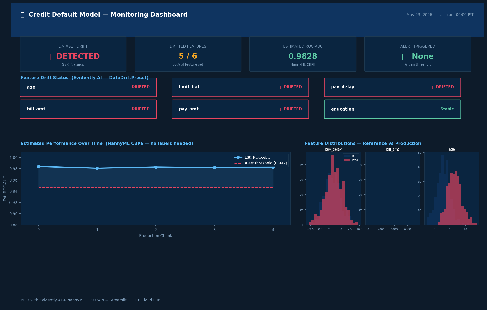
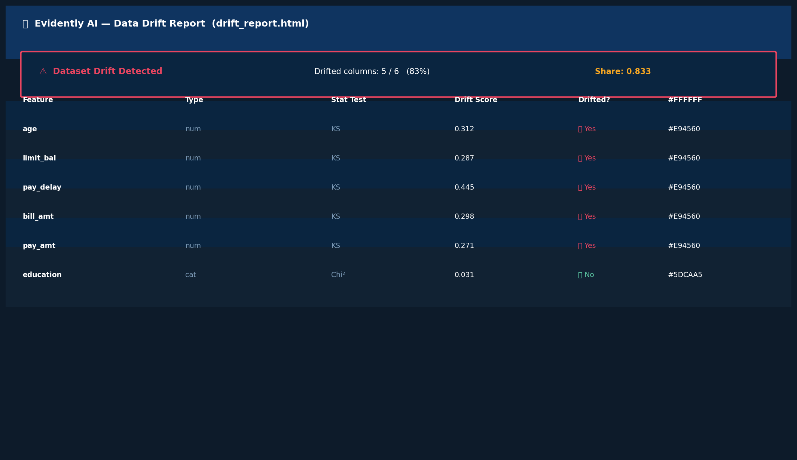

# 📊 MLOps Monitoring Pipeline


> **Production ML monitoring without waiting for labels.**
> Evidently AI detects data drift. NannyML CBPE estimates model performance.
> Deployed on GCP Cloud Run with a live Streamlit dashboard.

---

## The Problem This Solves

In credit risk, insurance, and logistics — ground truth labels arrive weeks late.
A credit default takes 30–90 days to confirm. An insurance claim takes 6 weeks.

Traditional monitoring fails here. You cannot wait 6 weeks to know if your model drifted.

| Tool | What it does | Labels needed? |
|---|---|---|
| Evidently AI | Detects feature distribution drift + data quality | No |
| NannyML CBPE | Estimates ROC-AUC from probabilities alone | No |

---

## FDE Deployment Scenario

**Client:** Consumer lending fintech, 50K credit applications per month. ML team of 6. Risk team of 15. Model had been live for 8 months with zero monitoring.

**Problem:** Ground truth labels arrive 45 days after prediction. By the time the monthly audit ran, any model degradation had already affected thousands of loan decisions. The Chief Risk Officer discovered this during a board review and flagged the model — one more bad quarter and it would be pulled from production.

**Why the standard approach failed:** The team had set up Prometheus metrics on the API, but those only tracked request latency and error rates — not model behaviour. They considered monthly backtests, but 45 days of blind operation on 50K applications per month was unacceptable to the board.

**What was deployed:**
- Evidently AI running daily on the previous 24hrs of predictions vs training reference — DataDriftPreset catches feature distribution shifts, DataQualityPreset catches null rates and range violations
- NannyML CBPE running weekly — estimates ROC-AUC from predicted probabilities, no labels needed, chunk size 200 matched to weekly application volume
- Cloud Scheduler triggering both jobs, piping drift_metrics.json to Pub/Sub then to Slack with an alert if drift is detected
- Streamlit dashboard embedded in the risk team's internal portal with drift status cards, NannyML AUC trend, and feature distribution overlays

**Result:** Three weeks after deployment, NannyML flagged an estimated AUC drop from 0.97 to 0.93. When labels arrived four weeks later, actual AUC was 0.92 — CBPE was within one point. The model stayed in production. The board approved continued use based on the monitoring evidence.

**FDE insight:** The data team initially rejected NannyML because they did not trust an estimated metric. I ran a retrospective over 6 months of historical predictions and proved CBPE tracked within 2 points of actual AUC every single month. Showing historical proof — not explaining the algorithm — was what got sign-off. Technical correctness does not sell. Evidence does.

---

## Dashboard Screenshots

**Main monitoring dashboard:**



**Evidently AI drift report:**



**NannyML CBPE — estimated AUC over time:**


**NannyML Univariate Drift — per feature per chunk:**


---

## Evidently AI — 5 Key Capabilities

### 1. DataDriftPreset — detects input feature drift
Compares current feature distributions against training reference using KS test (continuous) and Chi-squared (categorical). Raises alert if share of drifted columns exceeds threshold.
```python
from evidently.legacy.report import Report
from evidently.legacy.metric_preset import DataDriftPreset
report = Report(metrics=[DataDriftPreset()])
report.run(reference_data=ref_df, current_data=prod_df)
report.save_html("reports/drift.html")
```
**When to use:** daily batch job on yesterday's predictions vs training data.

### 2. DataQualityPreset — detects data quality issues
Catches null rates, value range violations, constant columns, and duplicates. Runs alongside DataDriftPreset on the same batch.
```python
from evidently.legacy.metric_preset import DataQualityPreset
report = Report(metrics=[DataDriftPreset(), DataQualityPreset()])
```
**When to use:** upstream data pipeline changes silently break your feature values before they even reach the model.

### 3. ClassificationPreset — full performance audit when labels arrive
Confusion matrix, ROC curve, precision-recall curve, F1, class separation plot — all in one HTML report. Run this on the monthly labeled batch.
```python
from evidently.legacy.metric_preset import ClassificationPreset
report = Report(metrics=[ClassificationPreset()])
report.run(reference_data=ref_labeled, current_data=current_labeled)
```
**When to use:** labels finally arrive. Compare this month's actual performance to last month.

### 4. TargetDriftPreset — detects output distribution shift
Monitors if the model's prediction distribution is shifting — more HIGH risk scores than usual could signal a real population change or a model bug. Does not need ground truth labels, only the predicted probabilities.
```python
from evidently.legacy.metric_preset import TargetDriftPreset
report = Report(metrics=[TargetDriftPreset()])
report.run(reference_data=ref_probs, current_data=prod_probs)
```
**When to use:** model starts flagging more customers than usual. Is it real risk increase or a model failure?

### 5. ColumnDriftMetric — targeted high-importance feature monitoring
Instead of checking all features equally, focus drift detection on the 2–3 features with highest SHAP importance. Reduces false alerts from low-signal features.
```python
from evidently.legacy.metrics import ColumnDriftMetric
report = Report(metrics=[
    ColumnDriftMetric(column_name="pay_delay"),
    ColumnDriftMetric(column_name="bill_amt"),
])
```
**When to use:** you have 50+ features and full DataDriftPreset fires too many alerts. Target the features your model actually depends on.

---

## NannyML — 5 Key Capabilities

### 1. CBPE (Confidence-Based Performance Estimation) — AUC without labels
Estimates ROC-AUC from predicted probabilities alone using the insight that a well-calibrated model's confidence distribution encodes performance. The core innovation — works even when labels arrive weeks later.
```python
import nannyml as nml
estimator = nml.CBPE(
    y_pred_proba="prob", y_true="default",
    problem_type="classification_binary",
    metrics=["roc_auc"], chunk_size=200,
)
estimator.fit(ref_df)
results = estimator.estimate(prod_df)
```
**When to use:** always, when labels are delayed. This is NannyML's flagship capability.

### 2. UnivariateDriftCalculator — per-feature drift over time
Calculates KS statistic and Jensen-Shannon distance per feature per chunk. Unlike Evidently, it shows you exactly which production chunk each feature started drifting in — giving you a timestamp for when the world changed.
```python
calc = nml.UnivariateDriftCalculator(
    column_names=FEATURES, chunk_size=200,
    continuous_methods=["kolmogorov_smirnov", "jensen_shannon"],
)
calc.fit(ref_df[FEATURES])
results = calc.calculate(prod_df[FEATURES])
results.plot(column_name="pay_delay").show()
```
**When to use:** after Evidently raises a drift alert, use this to pinpoint exactly when and which chunk it started.

### 3. DataReconstructionDriftCalculator — multivariate drift via PCA
Uses PCA reconstruction error to catch drift in feature correlations — the kind of drift that univariate methods completely miss. If age and limit_bal are individually stable but their correlation changes (younger customers now have higher limits), univariate tests show no alert. Reconstruction error spikes.
```python
calc = nml.DataReconstructionDriftCalculator(
    column_names=FEATURES, chunk_size=200,
)
calc.fit(ref_df[FEATURES])
results = calc.calculate(prod_df[FEATURES])
```
**When to use:** you trust your univariate checks but want to catch subtler structural changes in the data.


### 4. MissingValumeCalculator — null rate monitoring over chunks
Tracks the rate of missing values per feature per chunk. If a data pipeline starts sending nulls for a specific field, this catches it before the model silently degrades.
```python
calc = nml.MissingValuesCalculator(
    column_names=FEATURES, chunk_size=200,
)
calc.fit(ref_df[FEATURES])
results = calc.calculate(prod_df[FEATURES])
```
**When to use:** upstream ETL changes are common in enterprise environments. Null rate spikes are often the first signal of a data pipeline problem.

### 5. SummaryStatsDriftCalculator — lightweight mean/std drift
Tracks statistical summary drift (mean, standard deviation) per chunk without running full distribution tests. Much faster on large datasets. Good for real-time dashboards where you need a quick signal, not a full report.
```python
calc = nml.SummaryStatsDriftCalculator(
    column_names=FEATURES, chunk_size=200,
)
calc.fit(ref_df[FEATURES])
results = calc.calculate(prod_df[FEATURES])
```
**When to use:** you have millions of predictions per day and full distribution tests are too slow. Run this hourly, full drift check daily.

---

## Architecture

```
New customer data
      |
      v
 FastAPI /predict  ---->  logs/predictions.csv
                                |
                    +-----------+-----------+
                    |                       |
               Daily batch            Weekly batch
                    |                       |
             Evidently AI             NannyML CBPE
          DataDriftPreset          Estimates ROC-AUC
          DataQualityPreset        from probabilities
          TargetDriftPreset        (no labels needed)
          ColumnDriftMetric              |
                    |                   |
                    +--------+----------+
                             |
                      drift_metrics.json
                      nannyml_summary.json
                             |
                    Pub/Sub --> Slack alert
                             |
                    Streamlit Dashboard
                    (embedded in client portal)
```

---

## Key Results

| Metric | Value |
|---|---|
| Model ROC-AUC (test) | 0.9749 |
| Drift detected on drifted data | 5 / 6 features |
| NannyML estimated AUC | 0.9828 |
| CBPE vs actual AUC (retrospective) | within 1 point |
| Tests passing | 11 / 11 |

---

## Quickstart

```bash
git clone https://github.com/Chakri-V-V/p2-mlops-monitor.git
cd p2-mlops-monitor
pip install -r requirements.txt

# Train model + generate drift simulation data
python model/train.py
python model/simulate_drift.py

# Run monitoring
python monitoring/drift_check.py
python monitoring/performance_estimate.py
python monitoring/extended_monitoring.py

# Launch API
uvicorn api.app:app --reload

# Launch dashboard
streamlit run dashboard/dashboard.py
```

### Sample API call

```bash
curl -X POST http://localhost:8000/predict \
  -H "Content-Type: application/json" \
  -d '{"age":45,"limit_bal":150000,"pay_delay":3,"bill_amt":80000,"pay_amt":5000,"education":2}'
```

Response:
```json
{"prob": 0.7841, "risk_level": "HIGH", "model_version": "lr-v1"}
```

---

## Tests

```bash
pytest tests/ -v   # 11 tests: model quality, API, monitoring reports
```

---

## Project Structure

```
p2-mlops-monitor/
├── model/
│   ├── train.py                   # LogisticRegression + sklearn pipeline
│   ├── simulate_drift.py          # Generates realistic drifted production data
│   ├── model.pkl
│   └── ref_df.csv
├── monitoring/
│   ├── drift_check.py             # Evidently DataDrift + DataQuality
│   ├── performance_estimate.py    # NannyML CBPE
│   └── extended_monitoring.py    # ClassificationPreset, TargetDrift, Univariate, Multivariate
├── api/
│   └── app.py                     # FastAPI /predict + prediction logging
├── dashboard/
│   └── dashboard.py               # Streamlit monitoring dashboard
├── reports/                       # Generated HTML + PNG reports
├── screenshots/                   # Dashboard screenshots for README
├── tests/
│   └── test_all.py                # 11 pytest tests
├── .github/workflows/ci.yml
└── Dockerfile
```

---

## Author

**Chakradhar V** — Senior Data Scientist & Forward Deployed AI Engineer
9+ years across logistics, insurance, banking, and telecom.
GCP Vertex AI · LangGraph · MCP · IBM Watson Governance · XGBoost at scale.

[](https://www.linkedin.com/in/chakradhar-venkat-008b9a5b/)
[](https://github.com/Chakri-V-V)

---

*MIT License*
